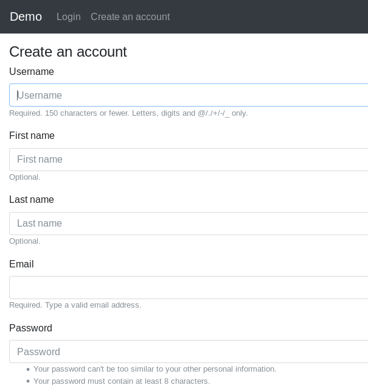

# Simple Django Login and Registration

An example of Django project with login, registration, log out and password recovery functionality.

## Screenshots

| Log In | Registration | Authorized page |
| -------|--------------|-----------------|
|  |  |  |

| Password reset | Set new password | Password change |
| ---------------|------------------|-----------------|
|  |  |  |

## Installing

### Clone the project

```
git clone https://github.com/egorsmkv/simple-django-login-and-register
cd simple-django-login-and-register/source
```

### Create virtual environment with `virtualenv`

### Install dependencies

```
pip install -r requirements-dev.txt # or requirements.txt if you deploy the project on a production server
```

### Create a MySQL database for the project

For example:

```
CREATE DATABASE `simple-django-login-and-register` COLLATE 'utf8mb4_unicode_ci';
```

### Configure the settings (connection to the database, connection to the smtp server, and other options)

1. Edit `source/app/conf/development/settings.py` if you want to develop the project.

2. Edit `source/app/conf/production/settings.py` if you want to run the project in production.

### Apply migrations

```
./manage.py migrate
```

### Collect static files (only a production server)

```
./manage.py collectstatic
```

### Running

#### A Development server

Just run that command:

```
./manage.py runserver
```

#### A Production server

##### If you have the `systemd` on your server

Empty now.

##### With the `supervisord`

Empty now.
